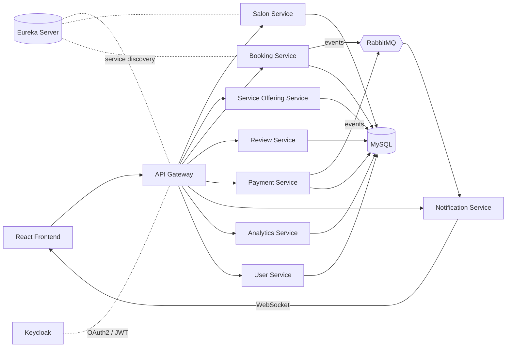

# Glamora - Salon Booking & Management Platform

A full-stack salon booking platform built with **React** and **Spring Boot microservices**. Customers can discover salons and book appointments, salon owners can manage their business, and administrators can oversee the whole platform.

---

## Table of Contents

- [Features](#features)
- [Tech Stack](#tech-stack)
- [Architecture](#architecture)
- [Microservices](#microservices)
- [Security](#security)
- [Getting Started](#getting-started)
- [Project Structure](#project-structure)
- [API Overview](#api-overview)
- [What I Learned](#what-i-learned)
- [Future Improvements](#future-improvements)
- [Author](#author)

---

## Features

**Customer**
- Browse salons and their service offerings
- Book, view and cancel appointments
- Pay online using Razorpay or Stripe
- Leave reviews and ratings
- Receive real-time notifications

**Salon Owner**
- Create and manage salon profiles
- Add and update services and pricing
- Manage incoming bookings
- View business analytics

**Administrator**
- Manage users and salons
- Monitor platform-wide activity and analytics

**Platform**
- Role-based access control (Customer / Salon Owner / Admin)
- Asynchronous communication between services with RabbitMQ
- Real-time notifications over WebSockets
- Centralized routing through an API Gateway

---

## Tech Stack

| Layer | Technologies |
|---|---|
| Frontend | React, JavaScript, HTML, CSS |
| Backend | Java, Spring Boot, Spring Data JPA, Hibernate, REST APIs |
| Microservices | Spring Cloud, Netflix Eureka, Spring Cloud Gateway, OpenFeign |
| Security | Spring Security, OAuth2, JWT, Keycloak |
| Messaging | RabbitMQ, WebSockets |
| Database | MySQL |
| Payments | Razorpay, Stripe |
| Tools | Maven, Git, Postman, Docker |

---

## Architecture



**How it works**

1. The React frontend sends every request to the **API Gateway**.
2. The gateway validates the JWT issued by **Keycloak** and routes the request to the right service, which it finds through **Eureka**.
3. Services call each other synchronously using **OpenFeign**.
4. Events such as a new booking or a completed payment are published to **RabbitMQ**, and the **Notification Service** pushes real-time updates to users over **WebSockets**.

---

## Microservices

| Service | Responsibility |
|---|---|
| Eureka Server | Service registry and discovery |
| API Gateway | Single entry point, routing, token validation |
| User Service | User profiles and roles |
| Salon Service | Salon registration and management |
| Service Offering | Services, pricing and duration per salon |
| Booking Service | Appointment booking and status |
| Review Service | Ratings and reviews |
| Payment Service | Razorpay and Stripe integration |
| Notification Service | RabbitMQ consumers and WebSocket push |
| Analytics Service | Reports for owners and admins |

---

## Security

- **Keycloak** acts as the identity provider (OAuth2 / OpenID Connect).
- APIs are protected with **Spring Security** and **JWT** bearer tokens.
- **Role-based authorization** restricts endpoints by role: `CUSTOMER`, `SALON_OWNER`, `ADMIN`.
- Secrets (database passwords, payment keys) are kept out of the repository and supplied through environment variables.

---

## Getting Started

### Prerequisites

- JDK 17 or later
- Maven 3.8+
- Node.js 18+ and npm
- MySQL 8
- RabbitMQ
- Keycloak
- Razorpay / Stripe test keys (optional, for payments)

### 1. Clone the repository

```bash
git clone https://github.com/malleswararaopalepogu/salon-booking.git
cd salon-booking
```

### 2. Set up the database

```sql
CREATE DATABASE glamora;
```

Update the datasource username and password in each service's `application.properties`.

### 3. Start Keycloak and RabbitMQ

```bash
docker run -d --name rabbitmq -p 5672:5672 -p 15672:15672 rabbitmq:3-management
docker run -d --name keycloak -p 8080:8080 \
  -e KEYCLOAK_ADMIN=admin -e KEYCLOAK_ADMIN_PASSWORD=admin \
  quay.io/keycloak/keycloak:latest start-dev
```

In the Keycloak admin console, create a realm, a client for the frontend, and the roles `CUSTOMER`, `SALON_OWNER` and `ADMIN`.

### 4. Run the backend services

Start the services in this order:

1. Eureka Server
2. API Gateway
3. All remaining services

```bash
cd backend/<service-name>
mvn spring-boot:run
```

Open the Eureka dashboard in your browser to confirm every service has registered.

### 5. Run the frontend

```bash
cd frontend
npm install
npm start
```

The app runs at `http://localhost:3000`.

### Environment variables

| Variable | Description |
|---|---|
| `DB_USERNAME` / `DB_PASSWORD` | MySQL credentials |
| `KEYCLOAK_ISSUER_URI` | Keycloak realm URL |
| `RAZORPAY_KEY_ID` / `RAZORPAY_KEY_SECRET` | Razorpay test keys |
| `STRIPE_SECRET_KEY` | Stripe test key |

---

## Project Structure

```
salon-booking/
├── backend/          # Spring Boot microservices
├── frontend/         # React application
├── .gitignore
└── README.md
```

---

## API Overview

All requests go through the API Gateway.

| Method | Endpoint | Description | Role |
|---|---|---|---|
| GET | `/api/salons` | List salons | Public |
| POST | `/api/salons` | Create a salon | Salon Owner |
| GET | `/api/salons/{id}/services` | Services offered by a salon | Public |
| POST | `/api/bookings` | Book an appointment | Customer |
| GET | `/api/bookings/me` | My bookings | Customer |
| POST | `/api/payments/checkout` | Start a payment | Customer |
| POST | `/api/reviews` | Add a review | Customer |
| GET | `/api/analytics/summary` | Business analytics | Owner / Admin |

---

## What I Learned

- Designing service boundaries and splitting a system into 8+ independent microservices
- Service discovery, API gateway routing and inter-service calls with OpenFeign
- Securing distributed services with OAuth2, JWT and Keycloak
- Event-driven communication with RabbitMQ and real-time updates with WebSockets
- Integrating third-party payment gateways

---

## Future Improvements

- [ ] Dockerize every service with a single `docker-compose.yml`
- [ ] Add unit and integration tests
- [ ] Add a CI pipeline with GitHub Actions
- [ ] Add centralized configuration (Spring Cloud Config) and distributed tracing
- [ ] Deploy to the cloud

---

## Author

**Palepogu Naga Malleswararao**

- GitHub: [malleswararaopalepogu](https://github.com/malleswararaopalepogu)
- LinkedIn: [malleswararaopalepogu](https://www.linkedin.com/in/malleswararaopalepogu/)
- Email: malleswararaopalepogu@gmail.com
